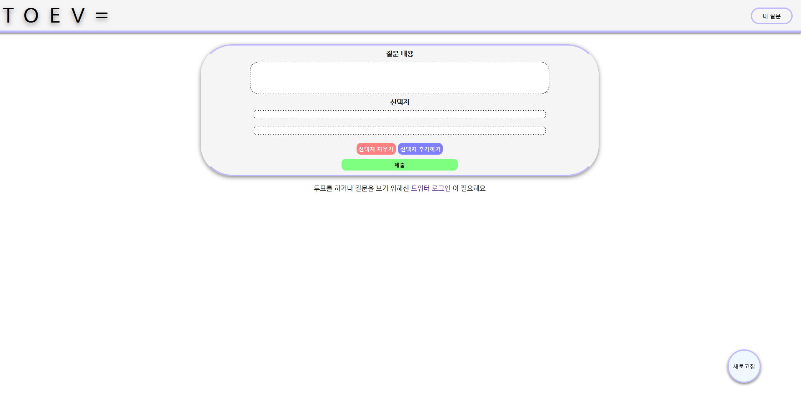
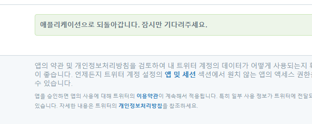
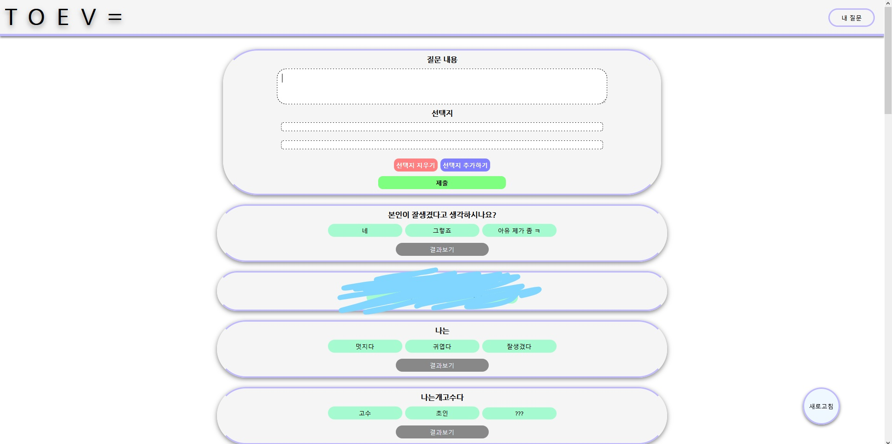
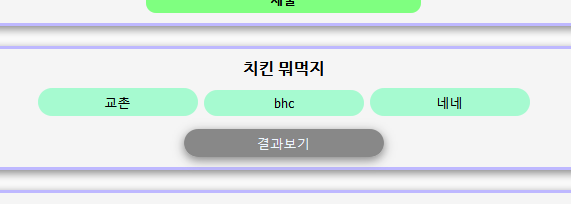
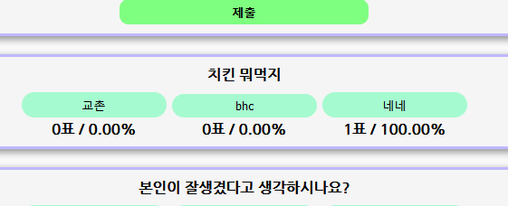
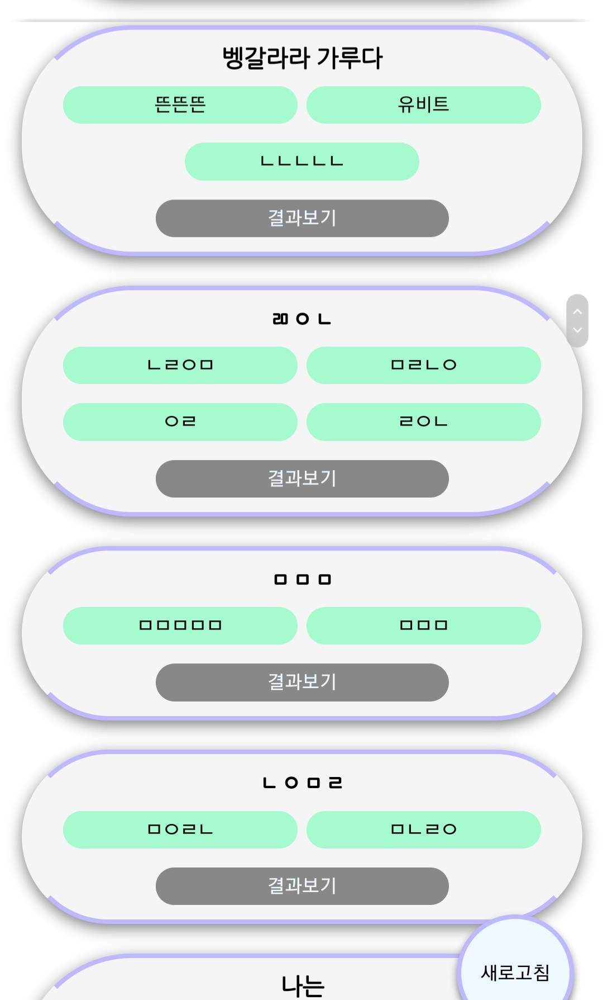
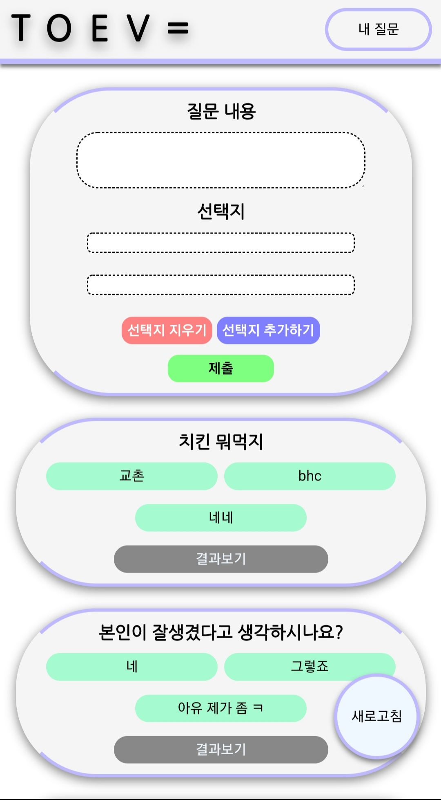

# TOEV
트위터 로그인 기반 투표 서비스
## 주의
본 프로젝트는 2018년 11월에 Node.js, HTML 및 CSS, OAuth, mySQL 연습용으로 제작되었습니다. 재기동이 가능하도록 코드를 일부 수정했습니다.
## 소개

SNS - 트위터 로그인으로 간단한 투표 사이트를 제작하였습니다.

### 로그인

다음과 같이 트위터 OAuth2로 로그인하면, 데이터베이스에 저장된 투표가 보입니다. 투표를 생성할 수 있고 최대 6개의 선택지까지 추가 가능합니다.
### 투표

투표를 위해 선택지를 고르면, 결과 확인 버튼이 활성화되며, 투표 결과를 볼 수 있습니다. 
### 모바일

 물론 모바일도 됩니다.
